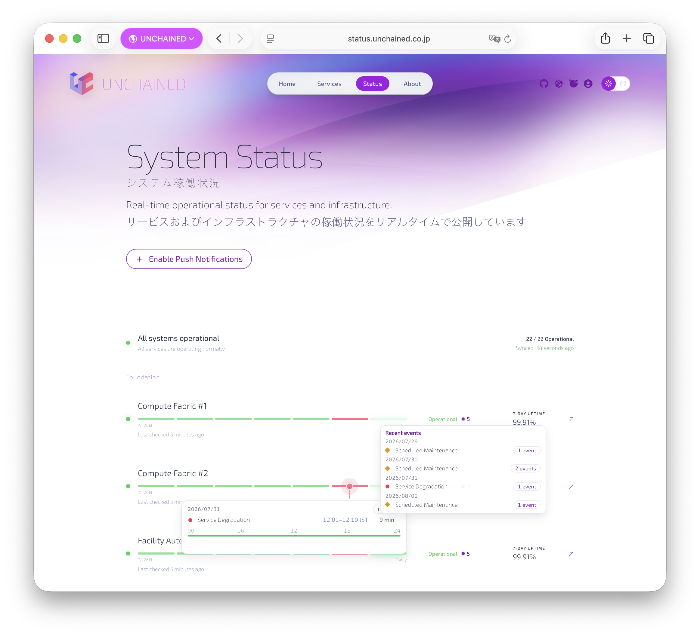
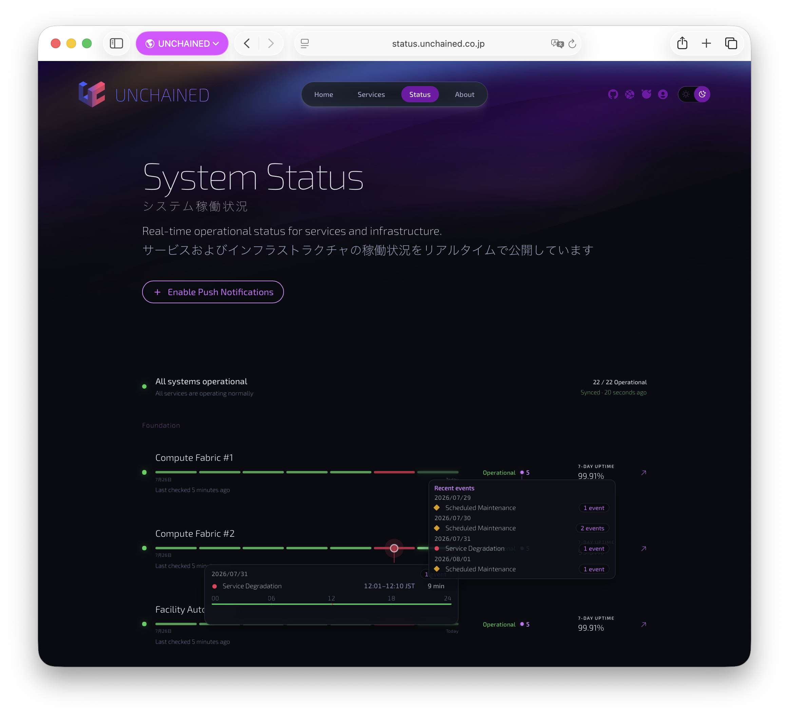

# UNCHAINED Status Page

**English | [日本語](./README_ja.md)**

Status page for `https://status.unchained.co.jp`.
Built with Astro + Cloudflare Pages Functions + Cloudflare Worker Cron.
Monitoring source is **updown.io**.

## Screenshots

### Light mode



### Dark mode



---

## What this software does

This project is not only a static status page UI.
It is a small status platform that:

- fetches check states from updown.io
- enriches data into a 7-day service timeline
- stores normalized snapshots/events in Cloudflare KV
- serves same-origin status APIs from Pages Functions
- delivers browser notifications through Declarative Web Push (no Service Worker registration)

In short:

- **Backend source of truth**: updown.io
- **Edge cache + event memory**: Cloudflare KV (`STATUS_EVENTS`)
- **API/UI delivery**: Cloudflare Pages Functions + Astro frontend
- **Background refresh + push fan-out**: Cloudflare Worker Cron

---

## What it provides to end users

- overall status summary (`Operational / Maintenance / Disruption`)
- per-service rows with:
  - live state
  - 7-day uptime timeline
  - event-aware timeline popovers
- freshness indicator (`Synced` / `Delayed`)
- push opt-in UI (`Enable Push Notifications` / `Push Notifications Enabled`)
- browser notifications on status transitions

---

## Runtime architecture

### 1) Data ingestion and enrichment

`workers/status-events-cron.ts` runs every minute (`*/1 * * * *`):

1. Refresh `status.snapshot.v1.json`
   - source: updown.io `/api/checks`
   - enrichment: `/metrics` + `/downtimes`
   - output: checks + period uptime + 7-day history
2. Refresh `events.json`
   - source: updown.io `/api/checks`
   - computes state transitions (`operational/maintenance/disruption`)
   - keeps only recent events window
3. If a new latest event exists, dispatch Declarative Web Push to subscribers

### 2) KV documents

- `status.snapshot.v1.json`
  - `{ generated_at, checks[] }`
  - optimized for fast UI list rendering
- `events.json`
  - `{ generated_at, events[], latest{} }`
  - optimized for transition/event timeline behavior
- `push:sub:<sha256(endpoint)>`
  - stored browser push subscriptions
- `push:last-event-id`
  - de-dup guard for push fan-out

### 3) API serving path

Frontend calls same-origin APIs:

- `GET /api/checks`
  - returns KV snapshot first
  - falls back to direct updown.io if snapshot missing
- `GET /api/events.json`
  - ensures freshness (`ensureFreshEventsDoc`)
  - returns `checked_at` per response for UI freshness display
- `GET /api/checks/{token}/downtimes`
- `GET /api/checks/{token}/metrics?from=...&to=...`
  - direct updown pass-through helpers (fallback/debug)

### 4) Push subscription + delivery path

Subscription APIs:

- `GET /api/push/config`
- `POST /api/push/subscribe`
- `POST /api/push/unsubscribe`

Delivery:

- uses VAPID JWT + aes128gcm payload encryption in `functions/_lib/web-push.ts`
- sends `web_push: 8030` Declarative payload
- stale subscriptions (`404/410`) are auto-removed

---

## API endpoints

| Method | Path | Purpose |
|---|---|---|
| GET | `/api/checks` | Snapshot-first checks list |
| GET | `/api/events.json` | Events doc + `checked_at` |
| GET | `/api/checks/{token}/downtimes` | Per-check downtime passthrough |
| GET | `/api/checks/{token}/metrics` | Per-check metrics passthrough |
| GET | `/api/push/config` | Push capability + VAPID public key |
| POST | `/api/push/subscribe` | Store push subscription |
| POST | `/api/push/unsubscribe` | Remove push subscription |

---

## Tech stack

- Astro `^7.0.9`
- TypeScript `^5.9.3`
- Cloudflare Pages Functions
- Cloudflare Workers (Cron)
- Cloudflare KV (`STATUS_EVENTS`)
- updown.io API
- Node.js `>=22.12.0`

---

## Environment and bindings

### Required secrets/vars

- `UPDOWN_API_KEY` (Pages + Worker)
- `PUSH_VAPID_PRIVATE_KEY` (secret)
- `PUSH_VAPID_PUBLIC_KEY` (plaintext var)
- KV binding: `STATUS_EVENTS`

### Worker config

`wrangler.events-cron.toml`:

```toml
name = "status-events-cron"
main = "workers/status-events-cron.ts"

[triggers]
crons = ["*/1 * * * *"]

[[kv_namespaces]]
binding = "STATUS_EVENTS"
id = "<namespace-id>"

[vars]
PUSH_VAPID_PUBLIC_KEY = "<public-vapid-key>"
```

Set secrets:

```bash
npx wrangler secret put UPDOWN_API_KEY -c wrangler.events-cron.toml
npx wrangler secret put PUSH_VAPID_PRIVATE_KEY -c wrangler.events-cron.toml
```

---

## Local development

Install:

```bash
npm install
```

Run commands:

```bash
npm run dev          # Astro dev server
npm run dev:ui       # UI dev server (http://localhost:4321)
npm run dev:cf       # Pages Functions + KV proxy (http://localhost:8788)
npm run dev:cf:dist  # Serve prebuilt dist via Pages dev
npm run check        # Astro/TS checks
npm run build        # Check + build
npm run preview      # Preview build
```

Recommended workflow:

1. `npm run dev:ui` for fast UI iteration
2. `npm run dev:cf` for API/KV integrated behavior

---

## Remote KV -> local KV sync (optional)

Useful when local `dev:cf` data differs from production.

Export remote keys:

```bash
mkdir -p debug-data/kv-sync

npx wrangler kv key get events.json \
  --namespace-id 6a495433dc4b40ecac1a328329474222 \
  --remote --text > debug-data/kv-sync/events.remote.json

npx wrangler kv key get status.snapshot.v1.json \
  --namespace-id 6a495433dc4b40ecac1a328329474222 \
  --remote --text > debug-data/kv-sync/status.snapshot.v1.remote.json
```

Import into local binding:

```bash
npx wrangler kv key put events.json \
  --path debug-data/kv-sync/events.remote.json \
  --namespace-id STATUS_EVENTS \
  --local --persist-to .wrangler/state

npx wrangler kv key put status.snapshot.v1.json \
  --path debug-data/kv-sync/status.snapshot.v1.remote.json \
  --namespace-id STATUS_EVENTS \
  --local --persist-to .wrangler/state
```

---

## Browser verification checklist

After deploy or cache-sensitive changes:

1. hard reload the page
2. verify timeline/date localization and popover interactions
3. verify freshness badge updates (`Synced` / `Delayed`)
4. verify push flow:
   - subscribe from toggle
   - trigger a real status transition
   - confirm notification delivery
5. for iOS/iPadOS push, verify from Home Screen app (not Safari tab)

---

## Project structure

```txt
src/
  pages/
    index.astro
public/
  global.css
functions/
  api/
    checks.ts
    events.json.ts
    checks/[token]/
      downtimes.ts
      metrics.ts
    push/
      config.ts
      subscribe.ts
      unsubscribe.ts
  _lib/
    updown.ts
    status-events.ts
    status-snapshot.ts
    push-subscriptions.ts
    web-push.ts
workers/
  status-events-cron.ts
wrangler.events-cron.toml
```

---

## Notes

- Push uses Declarative Web Push payload (`web_push: 8030`)
- No Service Worker registration is required for delivery in this implementation
- Push de-dup is managed by `push:last-event-id` in KV
- To test one-time resend, remove `push:last-event-id` in remote KV
